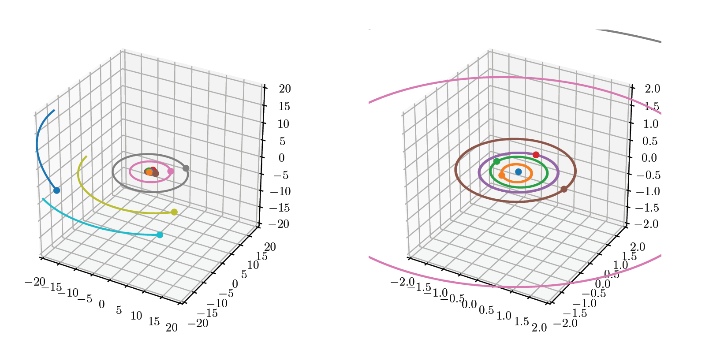

# Solarsystem

The code uses a third-order symplectic integrator discovered by Ruth in 1983 by default (see https://en.wikipedia.org/wiki/Symplectic_integrator) to simulate the solar system. This results in minimal energy drift over time and fairly accurate simulations comparable to the dataset from JPL (error up to a few thousand kilometers over 10 years). The code was used as part of my third-year technical high school project in 2019 about hamiltonian systems and the _n_-body problem.

Running `solarsystem.py` will simulate well known solar system bodies (Sun, planets, the Moon and Pluto) over a period of 10 years with a step size of 1 day. The three dimensional path, angular momentum, and energy are plotted after the simulation. 
The program requires astropy and astroquery for getting data from JPL's Horizon. Note that matplotlib 2.2.3 was used, and that a bug fix removed the ability to set a correct aspect ratio in 3D plots (See this stackoverflow [thread](https://stackoverflow.com/questions/13685386/matplotlib-equal-unit-length-with-equal-aspect-ratio-z-axis-is-not-equal-to)).

`gravitational_system.py` and `body.py` contains code for simulating general gravitational _n_-body systems using various numerical methods. A few numerical algorithms (Euler, symplectic Euler, Verlet, 3rd and 4th order methods by Ruth) are implemented as methods in the `nbody_system` class. The other files contain somewhat random experiments (e.g. comparisons to JPL data). The `initial.csv` file contains the initial conditions for the simulation. The default values correspond to the positions of the bodies on the 1st of January, 1970.

